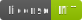

# SnowCrash DAO official token

SnowCrash DAO official token.

## $Nora

Name: SnowCrash Token  
Symbol: Nora  
Total Supply: 102,400,000 Nora  
Network: Binance Smart Chain (BSC)  
Contract: [0x1f39dd2bf5a27e2d4ed691dcf933077371777cb0](https://bscscan.com/token/0x1f39dd2bf5a27e2d4ed691dcf933077371777cb0)

[Buy Nora](https://snowcrash.finance/nora/)

## $PushDoge

Name: Pushinka Doge Token  
Symbol: PushDoge  
Total Supply: 3,844,000,000,000 PushDoge  
Network: Binance Smart Chain (BSC)  
Contract: [0x75c7651ecdabbea371109f999e57711540f0ec27](https://bscscan.com/token/0x75c7651ecdabbea371109f999e57711540f0ec27)

# SnowCrash DAO Token List

This list contains all the tokens in the SnowCrash DAO ecosystem (including all virtual company tokens in the MetaVoxel world). You can copy the URL below to import this list anywhere Token Lists are supported.

`https://tokens.snowcrash.finance/tokenlist.json`

